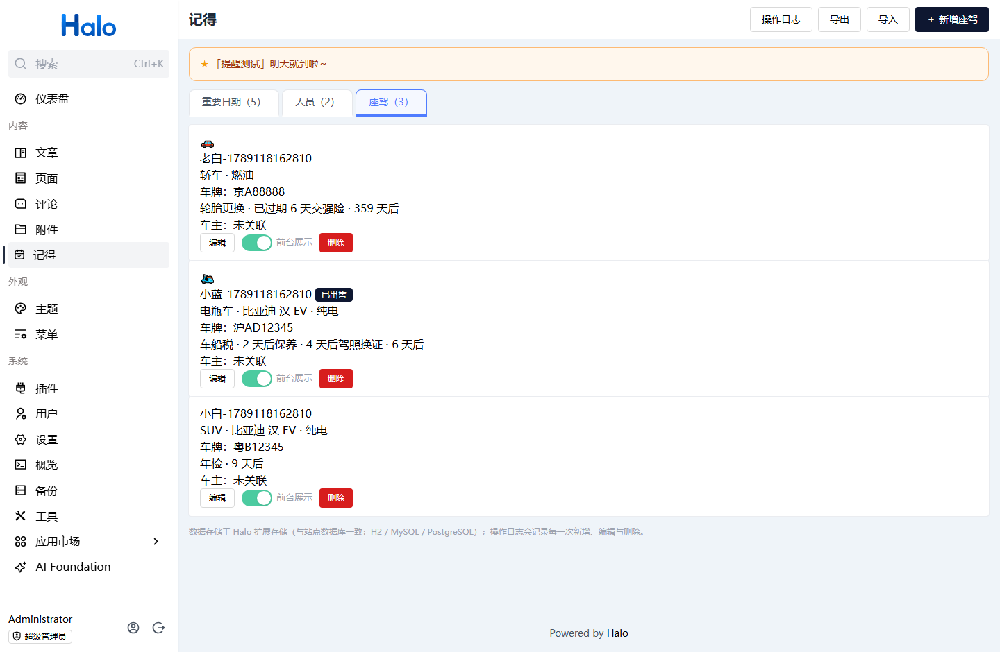
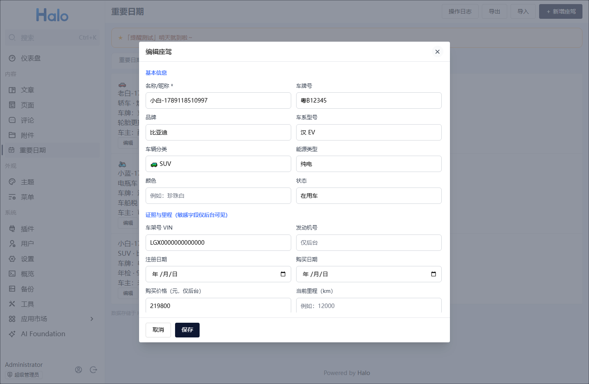
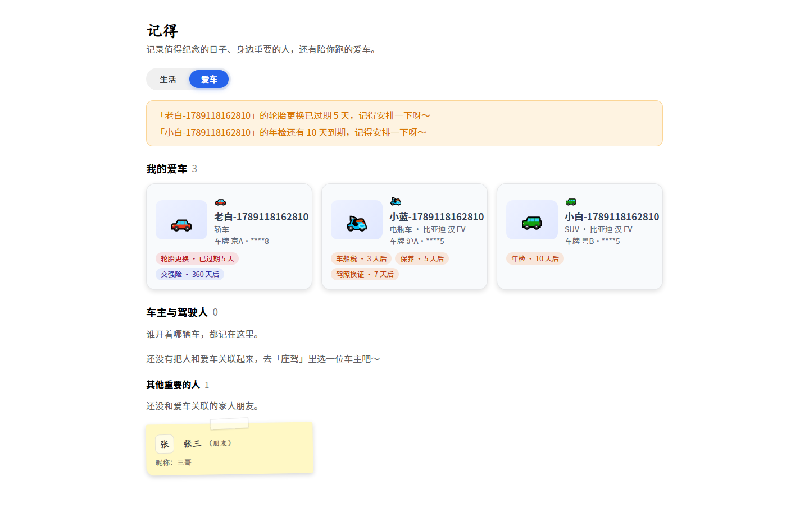
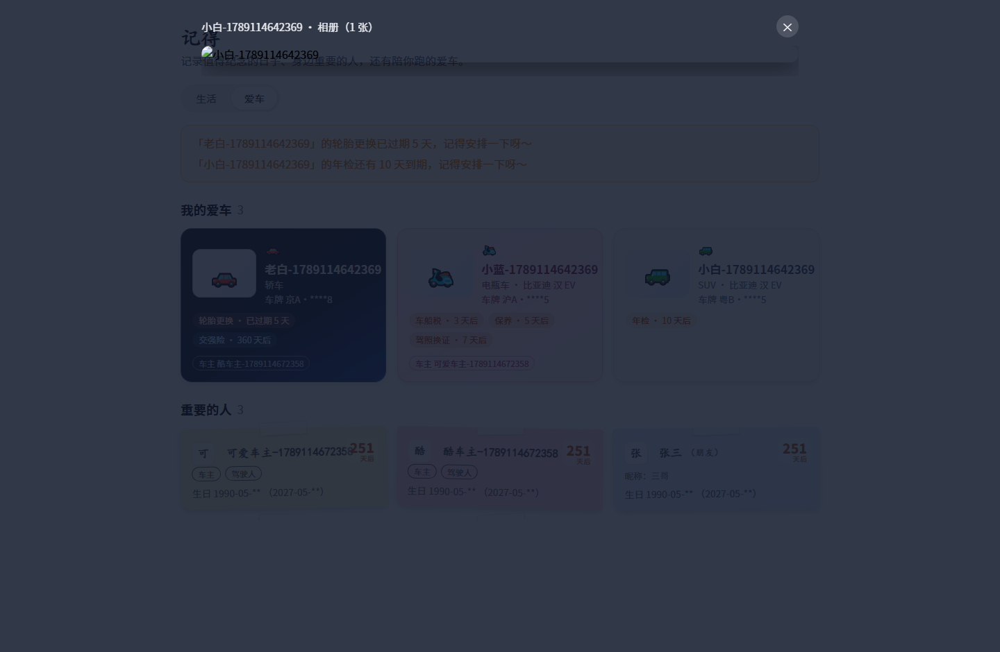

# 记得 · Remember — Important Dates & My Vehicles (plugin-important-dates)

[](https://github.com/yyliucha/plugin-important-dates/actions/workflows/build.yaml)
[](https://github.com/halo-dev/halo)

A Halo 2.x plugin that remembers things for you: anniversaries, birthdays and the people you care about — plus your vehicles (cars / e-bikes / bicycles) with insurance, inspection and maintenance due dates. Solar & lunar calendar support, photo albums, a public "Life / Garage" page, and privacy-first defaults. **No system config writes, no theme file writes.**

> **Renamed**: formerly “Important Dates” (重要日期), renamed to “**记得**” (Remember) in 1.2.0 — the plugin grew from "dates" to "dates, people and vehicles". The plugin ID (`plugin-important-dates`), your data, settings, frontend URL (`/important-dates`) and upgrade path are unchanged.

[中文版 README](README.md) ｜ [Releases](https://github.com/yyliucha/plugin-important-dates/releases) ｜ [Issues](https://github.com/yyliucha/plugin-important-dates/issues) ｜ Author: [yyliucha](https://github.com/yyliucha)

## Screenshots

| Screenshot | Description |
| --- | --- |
|  | **Dashboard widget**: upcoming reminders pinned on the console dashboard, refreshed every minute |
|  | **Admin tabs**: Important dates / People / Vehicles — reminder banner, card list, drag-to-sort |
|  | **Vehicles tab**: category icon, plate, due badges (overdue / soon), owner & drivers, frontend switch |
|  | **Vehicle form**: category (incl. e-bike / bicycle), energy type, documents & mileage, album, due items |
|  | **Public `/important-dates`** — Life view: important dates + the people you care about (birthday countdowns) |
|  | **Garage view**: vehicle cards (masked plate, due badges) + owners & drivers (matching badges) + other people |
|  | **Album viewer**: click a cover to browse full-screen (read-only, Esc to close); only photos marked “show” are public |
|  | **Site-wide toast**: configurable position, countdown + progress bar, dismiss menu (session / 3 days / 10 days / forever) |

## Features

**📅 Important dates**
- Name + date + multiline notes; **solar / lunar (incl. leap months)**, lunar dates auto-convert to the solar date of the current year
- **Yearly recurring** with “next occurrence” and “days left”; **drag-to-sort** (same order in admin and on the public page)
- Custom date picker: solar grid annotated with lunar days, lunar year/month/leap/day with live conversion; **the panel opens on the selected date when editing**

**👤 People**
- Name, nickname, relation (incl. “self”), birthday (solar/lunar), gender, blood type, height, weight, hobbies, notes, **avatar** (uploaded via the official attachment library or picked from it); drag-to-sort
- Dates can link to multiple people and be filtered by person

**🚗 Vehicles (cars / e-bikes / bicycles)**
- **17 categories** (sedan / SUV / MPV / sports / off-road / pickup / wagon / hatchback / crossover / van / RV / truck / bus / motorcycle / **e-bike / bicycle** / other), energy type (fuel / EV / PHEV / HEV / human), brand & model, colour, VIN, engine no., registration & purchase dates, mileage, status (in use / sold / scrapped)
- **Photo album**: upload or multi-select from the attachment library, drag to reorder, set cover; **each photo can be toggled visible/hidden** (hidden ones stay admin-only — handy for licence and insurance papers)
- **Due reminders**: compulsory & commercial insurance, inspection, maintenance (computed from last service + interval), road tax, licence renewal, custom items; per-item lead days and on/off; **yearly items roll over automatically**; sold/scrapped vehicles stop reminding
- **Linked people**: owner + regular drivers (optional); vehicle cards and person cards share the **same badge style** (cool for male, cute for female, neutral when unlinked)

**🔔 Reminders (three places, your choice)**
- **Dashboard widget** (Halo 2.21+): always visible, refreshed every minute (Dashboard → Edit → Add widget → Widget centre → group “记得”)
- **Admin + public banners**: “Tomorrow is「Wedding Anniversary」” / “Insurance of「小白」is due in 7 days”
- **Site-wide toast** (optional): position, wording and auto-close are configurable
- Dates and vehicle due items are **merged into one list sorted by days left**; the toast shows at most N items per type and merges the rest into a summary

**👁 Privacy**
- Dates, people and vehicles each have a “show on frontend” switch (vehicles default to off)
- Never rendered publicly: weight, blood type, height, hobbies, notes; **plates are always masked** (`粤B·****5`); VIN, engine number, policy number and purchase price are never exposed; birthdays are masked by default
- Photos not marked “show” never appear in the public album

**🏠 Public page (plugin default template, theme may override)**
- One page with a **“Life / Garage”** switch (remembered in the URL, `?view=car`): Life = important dates + the people you care about; Garage = vehicle cards + owners & drivers + other people
- **Album**: click a vehicle cover to browse full-screen (read-only)
- Uses the official **page layout contract** to reuse your theme shell (Halo fallback layout when the theme does not support it); a theme may override `templates/important-dates.html`; the plugin **never writes or modifies theme files** (zero leftovers after disabling/uninstalling)
- `importantDateFinder` is exposed: `listAll()` / `listAllPeople()` / `listAllCars()` / `listUpcoming(days)` / `listUpcomingCarEvents(days)`

**📊 More**
- **Operation log**: every create/update/delete for dates, people and vehicles, with paging and automatic cleanup (default: keep 30 days)
- **Export / import**: JSON (v3, including people and vehicles); duplicates are skipped, never overwritten; older export files remain importable

## Data & compliance

- Data lives in **Halo extension storage** (`importantdates.halo.run/v1alpha1`) — i.e. your site database (H2 / MySQL / PostgreSQL), backed up together with your site
- **Zero system config writes** (no “code injection”; scripts are emitted through the official `TemplateHeadProcessor`) and **zero theme file writes**
- **No network requests at all**; no user data is collected or uploaded

## Compatibility

- **Halo 2.26+** (built against the official 2.26 docs and extension points; Java 17 bytecode; full regression on a clean 2.26 instance: 44/44 passed)
- Administrators get all permissions after installation; no role setup needed

## Install & upgrade

1. Download `plugin-important-dates-*.jar` from [Releases](https://github.com/yyliucha/plugin-important-dates/releases);
2. Halo admin → **Plugins** → **Install** → upload the jar → enable (menu: **Content → 记得**);
3. Visit `https://your-domain/important-dates`.

**Upgrade**: disable → uninstall the old version → install the new jar → enable (your data is kept). If you use a page-cache/static plugin, clear the cache once after upgrading.

## Usage (admin)

- **Add a date**: name, date type, date (solar grid / lunar year-month-day), linked people (multi-select), notes; set “important” and “show on frontend”
- **People tab**: manage people and their frontend visibility; drag to sort
- **Vehicles tab**: manage vehicle records, album (per-photo “show” toggle) and due items; drag to sort; toggle frontend visibility right on the card
- **Operation log / export / import**: buttons at the top right
- **Reminder & privacy settings**: Plugins → 记得 → Settings (reminders, vehicles, photos, privacy, logs)

## Site-wide toast (optional, settings-driven)

- **Enable**: emitted through the official `TemplateHeadProcessor`; disabling removes it, uninstalling takes it away with the plugin
- **Position**: bottom-right / bottom-left / top-right / top-left / bottom-centre / screen-centre (default bottom-right)
- **Placeholders**: `{title}`, `{whenText}`, `{daysUntil}`, `{dateText}`, `{nextSolarDate}`
- **Behaviour**: auto-close (8s by default, with countdown and progress bar); the × menu offers **this time / 3 days / 10 days / forever**; the site owner can set the default × action and whether the menu is shown

> Historical note: versions up to 1.0.21 used “code injection”, and 1.0.30–1.1.1 maintained an injected snippet. Since 1.1.2 the plugin uses the official extension point — **if your site still has `id-toast:start/end` in Settings → Code injection, please delete it once.**

## Theme template (optional override)

The plugin **never writes theme files**. To fully customise the page, place `templates/important-dates.html` in your theme (TemplateNameResolver prefers it; delete it to fall back to the plugin default).

Available model data:
- Life view: `title`, `dates`, `people`, `reminders`, `showImportantTag`, `showAvatar`
- Garage view: `cars` (with `plateMasked`, `coverUrl`, `photos`, `skin`, `events`), `carEvents`, `carPeople`, `otherPeople`, `personCars`, `showCarSection`, `carSkinEnabled`, `view`

## Rebuild (optional)

Requires JDK 17+ (verified on JDK 23) and Node.js 18+:

```bash
cd plugin-important-dates
./gradlew build
```

The artifact is written to `build/libs/plugin-important-dates-<version>.jar` (current development version: `1.2.0-SNAPSHOT`; next release: `1.2.0`).

## License

[MIT](LICENSE)
