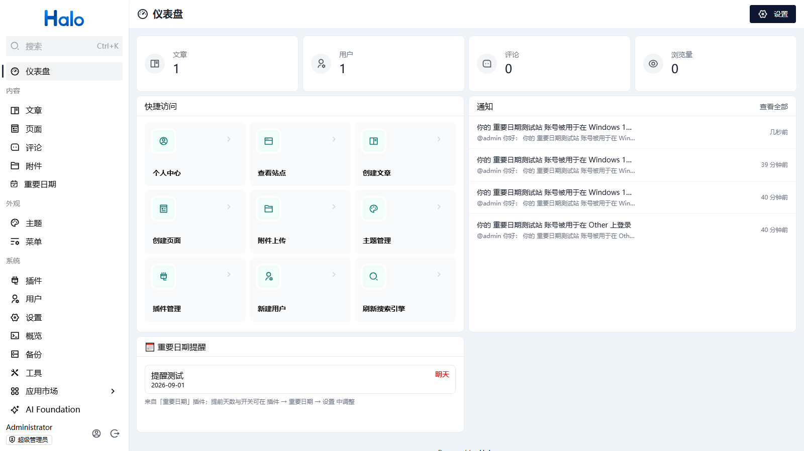
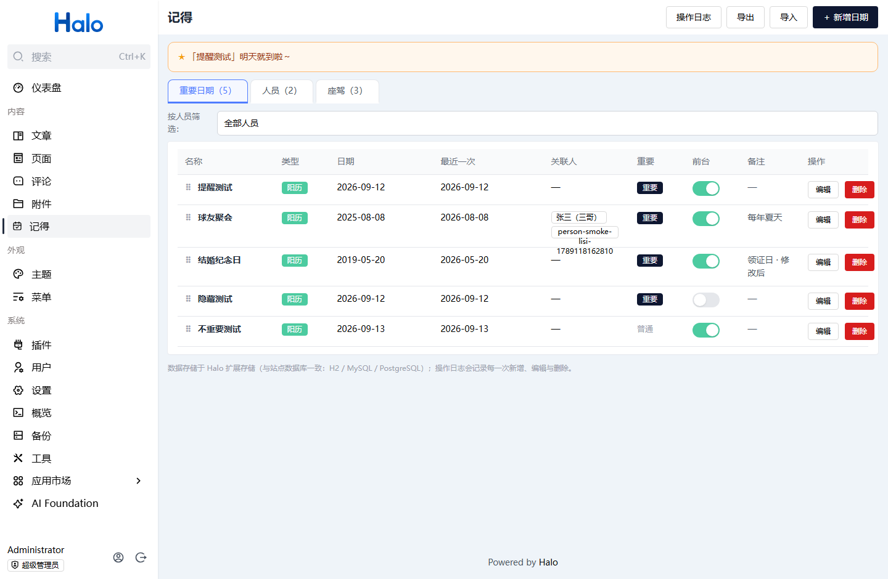
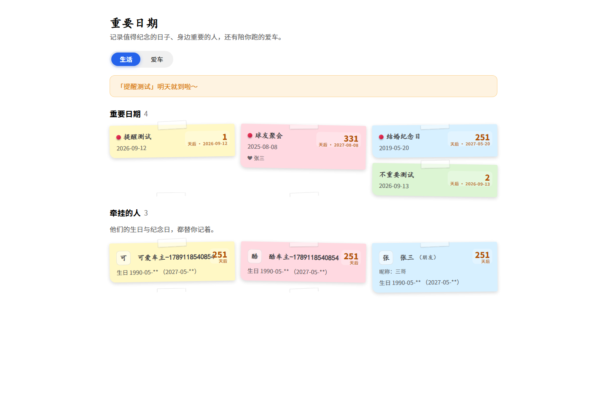
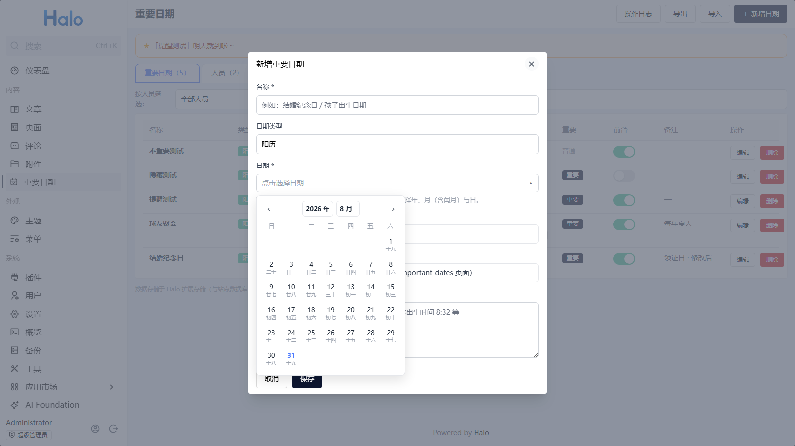
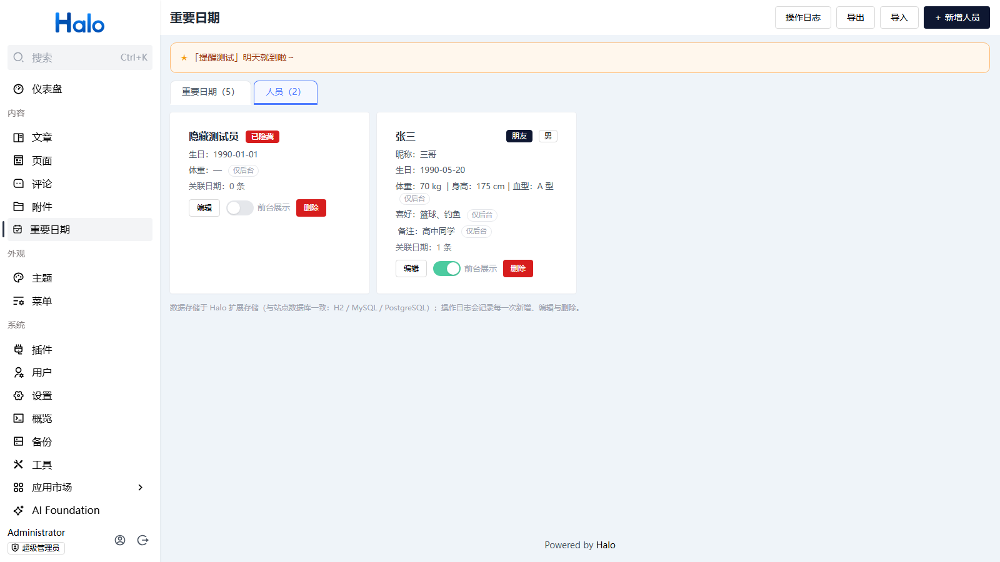
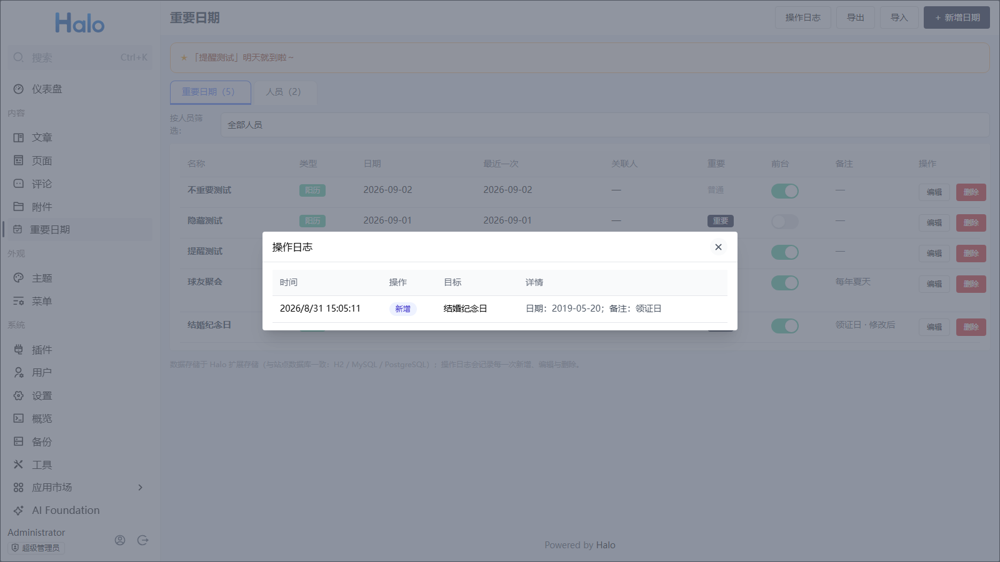
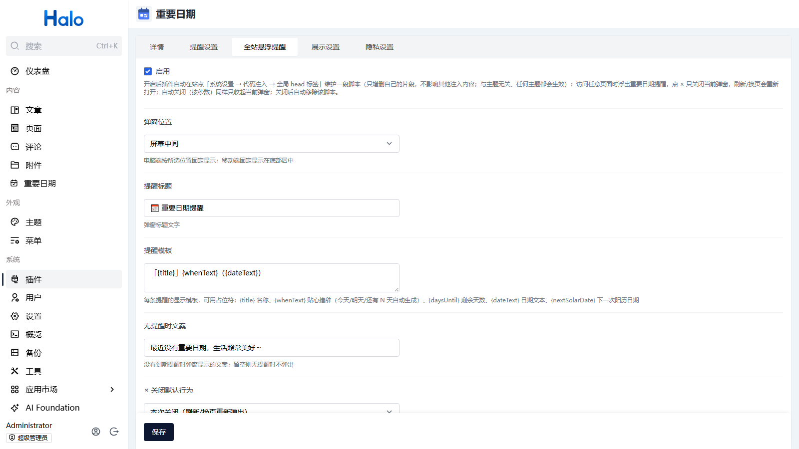
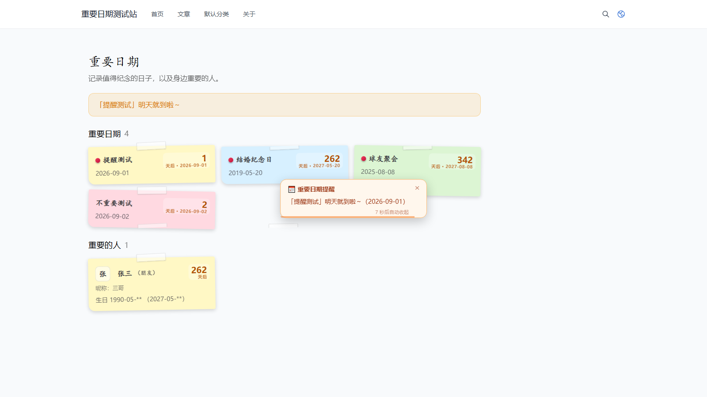

# 重要日期（plugin-important-dates）

[](https://github.com/yyliucha/plugin-important-dates/actions/workflows/build.yaml)
[](https://github.com/halo-dev/halo)

一个 Halo 2.x 插件：在**后台**记录并管理自己的重要日期与家人朋友，例如结婚纪念日、孩子出生日期，支持阳历/农历、到期提醒（仪表盘常驻 + 前台页面 + 全站悬浮弹窗）、主题内自动展示。

[English README](README.en.md) ｜ [Releases](https://github.com/yyliucha/plugin-important-dates/releases) ｜ [问题反馈](https://github.com/yyliucha/plugin-important-dates/issues) ｜ 作者：[yyliucha](https://github.com/yyliucha)

## 截图

> 以下为运行截图位置示意，替换为你的站点实际截图（图片放 `docs/screenshots/` 下，命名保持文件名一致即可自动显示；拍摄指引见 `docs/screenshots/README.md`）。

| 截图 | 说明 |
| --- | --- |
|  | **控制台仪表盘小组件**：到期提醒常驻仪表盘、一眼可见、无关闭按钮、每分钟自动刷新 |
|  | **后台「重要日期」页**：提醒横幅 + 日期列表（重要/前台开关、关联人、最近一次日期） |
|  | **前台 `/important-dates`**：自动在主题内打开，卡片式便签设计 + 提醒横幅 |
|  | **自研日期选择器**：阳历日历网格（格内标注农历）/ 农历年月日（含闰月） |
|  | **人员管理**：姓名/昵称/关系/生日/血型/身高/体重/喜好，敏感字段标注「仅后台」 |
|  | **操作日志弹窗**：每一次新增/编辑/删除的时间、操作、目标与变更详情 |
|  | **插件设置**：提醒天数、后台/前台提醒、全站悬浮提醒（位置/标题/模板/关闭行为）、隐私脱敏 |
|  | **全站悬浮提醒弹窗**：自选位置（含屏幕中间）、自动关闭倒计时、关闭方式菜单 |

## 功能

**📅 重要日期**
- 记录：**名称 + 日期 + 多行备注**；日期类型支持 **阳历 / 农历**（农历支持闰月）
- **每年自动循环**：阳历按"每年同月同日"；农历自动换算成当年阳历日期，列表显示"最近一次"
- **自研日期选择器**：阳历模式为日历网格（格子内标注农历）；农历模式可选年份、月份（含闰月）、日期并实时显示对应阳历；均支持**年/月下拉快选**
- **重要/普通标识**：默认重要，重要日期参与到期提醒，可作为全站提示的条件

**👤 人员管理**
- 人员字段：姓名、昵称、关系（配偶/子女/父母/朋友…）、生日（阳历/农历）、性别、血型、身高、体重（最新值）、喜好、备注
- 重要日期可**关联多人**（如结婚纪念日关联夫妻两人），列表支持**按人员筛选**

**🔔 到期提醒（三处，任你挑）**
- **控制台仪表盘小组件**（Halo 2.21+ 控制台）：到期提醒**常驻仪表盘、一眼可见、无关闭按钮**，每 60 秒自动刷新。添加一次即可：仪表盘 →「编辑仪表盘」→「添加部件」→「小部件中心」→ 分组「重要日期」→ 点击「重要日期提醒」卡片 →「保存」；旧版本 Halo 控制台自动忽略
- **后台「重要日期」页 + 前台 `/important-dates` 页顶部横幅**："「结婚纪念日」明天就到啦～" / "「宝宝生日」还有 3 天就到啦～" / "「纪念日」就是今天呀 🎉"
- **全站悬浮提醒**（可选）：任意页面右下角等位置弹出提示，自动关闭倒计时 + 进度条，关闭行为可配置（见下文）
- 提醒条件：**重要 + 前台可见 + 提前 N 天内（含当天）**；提前天数与各处开关均在**插件设置**中配置（默认提前 3 天）

**👁 前台可见性与隐私**
- 日期与人员各有「**前台展示**」开关（默认开）：关闭后仅后台可见，不出现在前台（含提醒），适合私人记录
- 前台只看得到名称、日期、关联人姓名、生日；**体重、血型、身高、喜好、备注永不出现在前台**（字段级裁剪）
- 生日前台**默认脱敏**（如 `1990-05-**` / `腊月**`，可在设置中关闭）

**🏠 前台页面（插件默认模板，主题可选覆盖）**
- 插件自带默认 Thymeleaf 模板：前台 `/important-dates` 无需任何手动操作即可渲染（**不写入、不修改任何主题文件**，停用/卸载零残留）
- 页面外壳走官方 **页面布局契约**：插件模板调用 `layout :: html(...)`——当前主题支持布局契约时**自动复用主题页头、页脚与整体外壳**，不支持时 Halo 使用内置 fallback 布局；全程零主题文件写入\n- 通过官方 **TemplateNameResolver** 解析模板名：主题作者/用户若主动提供 `themes/主题名/templates/important-dates.html` 则优先使用主题模板（可选增强）；页面模型带 `_templateId = plugin:plugin-important-dates:important-dates`（供 Head 处理器、SEO 等扩展识别）
- **卡片式设计**：月日徽章、大数字"还有 X 天"、重要胶囊徽章、人员首字头像卡，明暗色自适应，移动端响应式
- 提供 `importantDateFinder` Finder API（listAll / listAllPeople / listUpcoming），主题可完全自定义展示

> **主题未适配「页面布局契约」时如何嵌套（兼容指引）**
> 渲染顺序（官方 `TemplateNameResolver`）：① 主题有 `templates/important-dates.html` → 用主题模板（嵌套）；② 否则用插件默认模板——主题支持布局契约（2.26+ 有 `templates/layout.html`）→ 自动复用主题外壳；不支持 → Halo 使用内置 fallback 布局（独立内容页，功能完整）。
> 若你的主题尚未支持契约、又希望嵌套在主题内：复制 `docs/theme-override/clarity-important-dates.html` 到 `themes/主题名/templates/important-dates.html`（主题侧文件，插件永不修改；删除即回退默认）；生成其他主题的覆盖模板请参考 `docs/theme-override/README.md`。插件严格遵守官方案例：不写入、不修改、不删除任何主题文件。

**📊 操作日志**
- 每次新增、编辑、删除（日期或人员）以及"重要/前台"状态切换都会记录时间、操作类型、目标与变更详情，可在「操作日志」弹窗查看

**💾 导出 / 导入**
- 一键导出全部数据（含人员）为 `important-dates-YYYY-MM-DD.json`（备份/迁移）；导入按记录标识判重，**已存在自动跳过、不覆盖**，结果弹窗汇报（兼容旧版导出文件）

## 数据存储

- 记录、人员、操作日志均存储于 **Halo 扩展存储**（`importantdates.halo.run/v1alpha1`），底层就是**站点的数据库**——站点配置为 H2 则存 H2，配置为 MySQL/PostgreSQL 则存对应数据库（`extensions` 表），与站点数据同库同备份
- 插件**不含任何联网请求**（前端仅调用本站后台 API；不采集、不上传任何用户数据）

## 兼容性

- **Halo 2.26 及以上**（基于 2.20 平台 API 编译，Java 17 字节码；页面外壳通过官方「页面布局契约」复用主题布局：主题支持契约时用主题外壳，否则 Halo 使用 fallback 布局；已在 Halo 2.26 实测完整回归）
- 管理员安装后默认拥有全部权限，无需手动配置角色权限

## 安装

1. 从 [Releases](https://github.com/yyliucha/plugin-important-dates/releases) 下载最新的 `plugin-important-dates-*.jar`；
2. Halo 后台 → **插件** → **安装** → **本地安装** → 上传 jar，启用后左侧菜单 **内容 → 重要日期** 出现；
3. 前台访问 `https://你的域名/important-dates`（无需其他配置，自动在主题内打开）。

**升级**：在插件列表中先**停用**，再**卸载**旧版本，然后安装新 jar 并启用（数据在站点数据库中，不会丢失）。若站点使用了页面静态化/缓存类插件，启用后请清理一次页面缓存。

## 使用（后台）

- **新增日期**：右上角「+ 新增日期」→ 名称、日期类型、日期（日历面板：阳历点选 / 农历选年月日）、关联人员（可多选）、备注；可勾选「重要」参与提醒、「前台展示」控制是否公开
- **人员页签**：管理人员信息；人员卡片上可直接切换「前台展示」
- **列表**：显示类型、日期、最近一次、关联人、重要标记、前台开关；顶部可按人员筛选
- **操作日志**：右上角按钮查看全部变更明细
- **导出 / 导入**：右上角按钮备份与恢复（导入会先校验，重复自动跳过）
- **提醒配置**：后台「插件 → 重要日期 → 设置」

## 全站悬浮提醒（可选，设置驱动）

插件设置 →「**全站悬浮提醒**」组：

- **启用**：开启后插件通过 Halo 官方 **`TemplateHeadProcessor`** 扩展点（主题端 HTML Head 标签处理）按设置输出脚本标签 —— **不读写站点系统配置（含代码注入），不残留任何系统级改动**；关闭功能即不输出，插件停用/卸载即随插件消失
- **弹窗位置**：右下角 / 左下角 / 右上角 / 左上角 / 底部居中 / 屏幕中间（默认右下角）
- **提醒标题 / 提醒模板 / 无提醒时文案**：占位符 `{title}` 名称、`{whenText}` 贴心措辞（就是今天呀 🎉 / 明天就到啦～ / 还有 N 天就到啦～）、`{daysUntil}` 剩余天数、`{dateText}` 日期文本、`{nextSolarDate}` 下一次阳历日期
- **行为**：自动关闭（默认 8 秒，弹窗内显示**倒计时 + 进度条**）；点 × 弹出「关闭方式」菜单：**本次关闭**（仅收起当前弹窗）/ **3 天内不显示** / **10 天内不显示** / **永久关闭**（5 秒未选择按「× 关闭默认行为」执行；时长/永久记录在访客浏览器 localStorage，到期自动恢复）
- **站主设置**：**× 关闭默认行为**（本次 / 1 天 / 3 天 / 7 天 / 10 天 / 30 天 / 永久）+ **关闭方式菜单**开关

> 升级说明：
> - 1.0.21 及以前版本使用「手动粘贴脚本（代码注入）」的方式，若已粘贴过旧脚本，请到「系统设置 → 代码注入」删除它；
> - 1.0.30–1.1.1 版本曾自动维护「代码注入」片段，升级到 1.1.2 后插件改为官方扩展点注入，**请把之前自动写入的 `id-toast:start/end` 片段从「系统设置 → 代码注入」删除一次**（插件不再读写系统配置）；
> - 若主题目录 `themes/主题名/templates/important-dates.html` 存在旧版本自动生成的文件：保留 = 作为主题自定义覆盖（优先渲染），删除 = 使用插件默认模板。

## 主题模板（自定义展示，可选）

插件已自动生成主题模板，无需手动操作。想**完全自定义**展示时，编辑主题里的 `templates/important-dates.html`（或参考下列数据自行新建，注意删除旧文件后插件会重新生成）：

模板可直接消费的数据：`title`、`dates`（title/dateText/nextSolarDate/daysUntil/personNames/important）、`people`（displayName/nickname/relation/birthdayText/nextSolarDate/daysUntil）、`reminders`（即将到来的重要日期）、`showImportantTag`。也可以直接调用 `importantDateFinder` Finder API 获取数据。

## 重新构建（可选）

需要 JDK 17+（已在 JDK 23 下验证）、Node.js 18+ 与 npm：

```bash
cd plugin-important-dates
./gradlew build
```

构建结果位于 `build/libs/plugin-important-dates-1.1.3.jar`。

> 版本说明：**开发版使用 1.0.x 序列**（1.0.0 → 1.0.1 → …），**正式版从 1.1.0 开始**（1.1.0 → 1.1.1 → …），应用市场首发为 1.1.0。

## License

[MIT](LICENSE)


